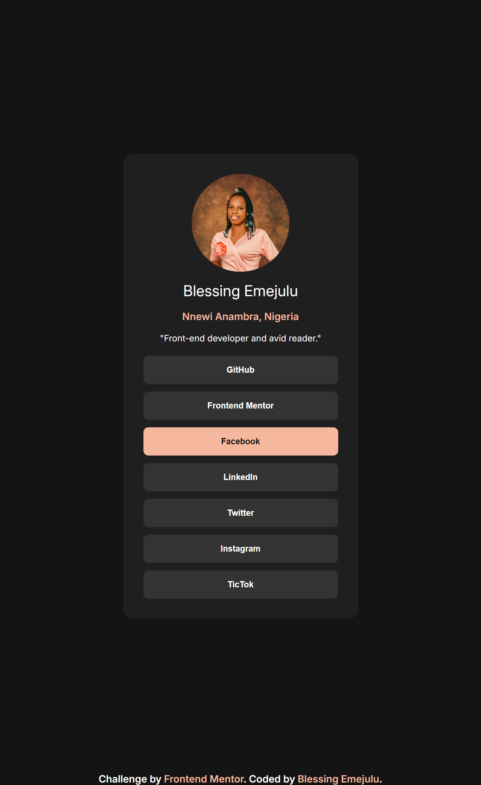

# Frontend Mentor - Social links profile solution

This is a solution to the [Social links profile challenge on Frontend Mentor](https://www.frontendmentor.io/challenges/social-links-profile-UG32l9m6dQ). Frontend Mentor challenges help you improve your coding skills by building realistic projects. 

## Table of contents

- [Overview](#overview)
  - [The challenge](#the-challenge)
  - [Screenshot](#screenshot)
  - [Links](#links)
- [My process](#my-process)
  - [Built with](#built-with)
- [Author](#author)
- [Acknowledgments](#acknowledgments)

## Overview

### The challenge

Users should be able to:

- See hover and focus states for all interactive elements on the page

### Screenshot

### Links

- Solution URL: [https://github.com/BlessingEmejulu/my-social-links](https://github.com/BlessingEmejulu/my-social-links)
- Live Site URL: [https://blessedtechiesocials.netlify.app/](https://blessedtechiesocials.netlify.app/)

## My process

### Built with

- Semantic HTML5 markup
- CSS custom properties
- Flexbox

## Author

- Website - [Blessing Emejulu](https://github.com/BlessingEmejulu/my-social-links)
- Frontend Mentor - [@BlessingEmejulu](https://www.frontendmentor.io/profile/BlessingEmejulu)
- Twitter - [@BlessedTechie](https://www.twitter.com/BlessedTechie)

## Acknowledgments

Thanks to me

